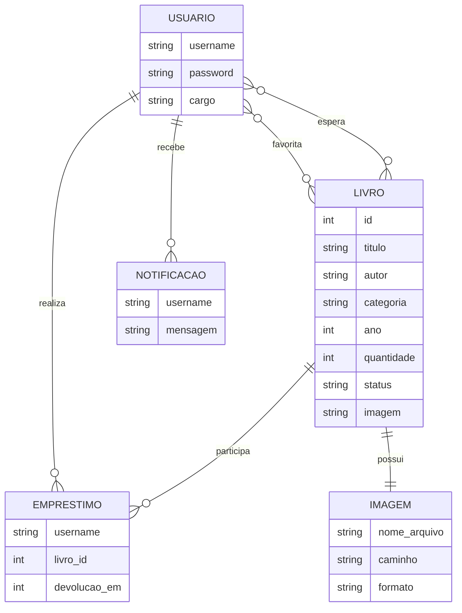

# Modelagem da Base de Dados - Sistema de Biblioteca Digital

## 1. Introducao

Este documento apresenta a modelagem da base de dados do sistema Biblioteca Municipal Online, desenvolvido com Python, FastAPI, Redis e React. O objetivo da modelagem e descrever como os dados sao organizados, armazenados, relacionados e manipulados dentro da aplicacao.

A modelagem correta da base de dados e essencial para garantir consistencia, desempenho, manutencao e clareza na implementacao do sistema. Em um sistema de biblioteca digital, e necessario estruturar informacoes sobre livros, usuarios, emprestimos, favoritos, lista de espera, notificacoes e controle de disponibilidade.

Como o Redis e um banco de dados NoSQL orientado a estruturas de dados em memoria, a modelagem nao utiliza tabelas relacionais tradicionais. Em vez disso, os dados sao armazenados em chaves, hashes, sets, lists, sorted sets e contadores, de acordo com o tipo de acesso esperado pela aplicacao.

## 2. Levantamento de Requisitos

| Requisito | Descricao |
|---|---|
| Cadastro de livros | O administrador deve cadastrar livros com titulo, autor, categoria, ano, quantidade, status e imagem. |
| Consulta de livros | Usuarios e administradores devem visualizar os livros cadastrados. |
| Atualizacao de livros | O administrador deve alterar dados de livros ja cadastrados. |
| Exclusao de livros | O administrador deve remover livros sem emprestimos ativos. |
| Cadastro de usuarios | Novos usuarios podem criar conta no sistema. |
| Autenticacao/login | O sistema deve autenticar usuarios usando credenciais HTTP Basic. |
| Controle de estoque | Cada livro possui uma quantidade disponivel. |
| Disponibilidade | O status do livro deve indicar se ele esta disponivel ou emprestado. |
| Emprestimos | Usuarios podem pegar livros emprestados quando houver estoque. |
| Devolucoes | Usuarios podem devolver livros emprestados. |
| Favoritos | Usuarios podem salvar livros favoritos. |
| Lista de espera | Usuarios podem entrar na espera quando um livro estiver sem estoque. |
| Notificacoes | Usuarios recebem notificacoes quando um livro volta ao estoque ou quando um prazo expira. |
| Upload de imagens | Cada livro pode possuir imagem de capa armazenada no front-end. |
| Painel administrativo | Administradores gerenciam livros e usuarios. |

## 3. Modelagem Conceitual

### Usuario

Representa uma pessoa cadastrada no sistema. O usuario pode consultar livros, realizar emprestimos, salvar favoritos, entrar em listas de espera e visualizar notificacoes.

| Atributo | Descricao |
|---|---|
| username | Identificador unico do usuario. |
| password | Senha utilizada para autenticacao. |
| cargo | Perfil de acesso: Admin ou User. |

### Administrador

O administrador e um tipo especial de usuario. No sistema, ele possui o campo `cargo` com valor `Admin`.

| Atributo | Descricao |
|---|---|
| username | Identificador do administrador. |
| password | Senha de acesso. |
| cargo | Valor `Admin`. |

### Livro

Representa uma obra cadastrada na biblioteca digital.

| Atributo | Descricao |
|---|---|
| id | Identificador numerico incremental do livro. |
| titulo | Titulo do livro. |
| autor | Autor da obra. |
| categoria | Categoria ou genero do livro. |
| ano | Ano de publicacao. |
| quantidade | Quantidade disponivel em estoque. |
| status | Disponivel ou Emprestado. |
| imagem | Nome do arquivo da imagem de capa. |

### Emprestimo

Representa o vinculo temporario entre um usuario e um livro emprestado.

| Atributo | Descricao |
|---|---|
| username | Usuario que realizou o emprestimo. |
| livro_id | Identificador do livro emprestado. |
| devolucao_em | Timestamp limite para devolucao. |

### Favoritos

Representa o conjunto de livros marcados como favoritos por um usuario.

| Atributo | Descricao |
|---|---|
| username | Usuario dono da lista. |
| livro_id | Livro favoritado. |

### Lista de Espera

Representa usuarios aguardando a disponibilidade de um livro sem estoque.

| Atributo | Descricao |
|---|---|
| username | Usuario interessado no livro. |
| livro_id | Livro aguardado. |

### Notificacoes

Representa mensagens enviadas ao usuario sobre eventos do sistema.

| Atributo | Descricao |
|---|---|
| username | Usuario que recebe a notificacao. |
| mensagem | Texto da notificacao. |

### Imagens dos Livros

Representa os arquivos de capa dos livros, armazenados no front-end em `frontend/public/livros`.

| Atributo | Descricao |
|---|---|
| imagem | Nome do arquivo associado ao livro. |
| formato | Extensao do arquivo: png, jpg, jpeg ou webp. |
| caminho | Caminho publico usado pelo React. |

## 4. Modelagem Logica no Redis

### Chave: `livro_id`

Contador incremental utilizado para gerar o proximo ID de livro.

| Campo | Tipo Redis | Descricao |
|---|---|---|
| livro_id | String numerica | Incrementada com `INCR`. |

### Chave: `livro:{id}`

Armazena os dados principais de um livro.

| Campo | Tipo | Obrigatorio | Validacoes |
|---|---|---|---|
| id | Integer | Sim | Gerado automaticamente. |
| titulo | String | Sim | Nao vazio. |
| autor | String | Sim | Nao vazio. |
| categoria | String | Sim | Nao vazio. |
| ano | Integer | Sim | Ano valido. |
| quantidade | Integer | Sim | Cadastro: maior que 0; atualizacao: maior ou igual a 0. |
| status | String | Sim | `Disponivel` ou `Emprestado`. |
| imagem | String | Nao | Arquivo png, jpg, jpeg ou webp. |

Estrutura Redis:

```txt
Tipo: Hash
Exemplo de chave: livro:1
```

### Chave: `usuario:{username}`

Armazena os dados de autenticacao e permissao de um usuario.

| Campo | Tipo | Obrigatorio | Validacoes |
|---|---|---|---|
| username | String | Sim | Minimo 3 e maximo 50 caracteres. |
| password | String | Sim | Minimo 3 e maximo 100 caracteres. |
| cargo | String | Sim | `Admin` ou `User`. |

Estrutura Redis:

```txt
Tipo: Hash
Exemplo de chave: usuario:joao
```

### Chave: `emprestimo:{username}:{livro_id}`

Armazena um emprestimo ativo de um usuario para um livro.

| Campo | Tipo | Obrigatorio | Validacoes |
|---|---|---|---|
| username | String | Sim | Usuario existente. |
| livro_id | Integer | Sim | Livro existente. |
| devolucao_em | Integer | Sim | Timestamp futuro. |

Estrutura Redis:

```txt
Tipo: Hash
Exemplo de chave: emprestimo:joao:1
```

### Chave: `usuario:{username}:emprestimos`

Conjunto com os IDs dos livros atualmente emprestados pelo usuario.

| Valor | Tipo | Descricao |
|---|---|---|
| livro_id | Integer | ID de livro emprestado. |

Estrutura Redis:

```txt
Tipo: Set
Exemplo de chave: usuario:joao:emprestimos
```

### Chave: `usuario:{username}:favoritos`

Conjunto com os IDs dos livros favoritos do usuario.

| Valor | Tipo | Descricao |
|---|---|---|
| livro_id | Integer | ID de livro favoritado. |

Estrutura Redis:

```txt
Tipo: Set
Exemplo de chave: usuario:joao:favoritos
```

Sets impedem duplicidade automaticamente, o que atende a regra de nao repetir favoritos.

### Chave: `usuario:{username}:espera`

Conjunto com livros nos quais o usuario entrou em lista de espera.

| Valor | Tipo | Descricao |
|---|---|---|
| livro_id | Integer | ID de livro aguardado. |

Estrutura Redis:

```txt
Tipo: Set
Exemplo de chave: usuario:joao:espera
```

### Chave: `livro:{livro_id}:espera`

Conjunto com usuarios aguardando a disponibilidade de um livro.

| Valor | Tipo | Descricao |
|---|---|---|
| username | String | Usuario em espera. |

Estrutura Redis:

```txt
Tipo: Set
Exemplo de chave: livro:1:espera
```

### Chave: `usuario:{username}:notificacoes`

Lista de notificacoes do usuario.

| Valor | Tipo | Descricao |
|---|---|---|
| mensagem | String | Mensagem enviada ao usuario. |

Estrutura Redis:

```txt
Tipo: List
Exemplo de chave: usuario:joao:notificacoes
```

### Chave: `emprestimos_vencimento`

Controla o vencimento dos emprestimos ativos.

| Membro | Score | Descricao |
|---|---|---|
| `{username}:{livro_id}` | Timestamp | Momento de devolucao automatica. |

Estrutura Redis:

```txt
Tipo: Sorted Set
Exemplo de chave: emprestimos_vencimento
```

## 5. Relacionamentos

Embora o Redis nao trabalhe com relacionamentos formais como bancos relacionais, a aplicacao cria relacoes por meio de padroes de chaves.

| Relacionamento | Cardinalidade | Implementacao |
|---|---|---|
| Usuario - Emprestimos | 1:N | `usuario:{username}:emprestimos` armazena varios IDs de livros. |
| Livro - Emprestimos | 1:N | Chaves `emprestimo:{username}:{livro_id}` associam livros a usuarios. |
| Usuario - Favoritos | 1:N | `usuario:{username}:favoritos` armazena varios livros favoritos. |
| Usuario - Livro Favorito | N:N | Um usuario pode favoritar varios livros, e um livro pode ser favorito de varios usuarios. |
| Usuario - Lista de Espera | N:N | `usuario:{username}:espera` e `livro:{livro_id}:espera` mantem a relacao nos dois sentidos. |
| Livro - Imagem | 1:1 | Campo `imagem` dentro de `livro:{id}` aponta para o arquivo da capa. |
| Usuario - Notificacoes | 1:N | `usuario:{username}:notificacoes` armazena varias mensagens. |

## 6. Modelagem Fisica

### Exemplo de livro

```json
{
  "chave": "livro:1",
  "tipo": "Hash",
  "valor": {
    "id": "1",
    "titulo": "1984",
    "autor": "George Orwell",
    "categoria": "Ficcao",
    "ano": "1949",
    "quantidade": "2",
    "status": "Disponivel",
    "imagem": "1984.png"
  }
}
```

### Exemplo de usuario

```json
{
  "chave": "usuario:maria",
  "tipo": "Hash",
  "valor": {
    "username": "maria",
    "password": "123456",
    "cargo": "User"
  }
}
```

### Exemplo de administrador

```json
{
  "chave": "usuario:admin",
  "tipo": "Hash",
  "valor": {
    "username": "admin",
    "password": "admin",
    "cargo": "Admin"
  }
}
```

### Exemplo de emprestimo

```json
{
  "chave": "emprestimo:maria:1",
  "tipo": "Hash",
  "valor": {
    "username": "maria",
    "livro_id": "1",
    "devolucao_em": "1779023400"
  }
}
```

### Exemplo de favoritos

```json
{
  "chave": "usuario:maria:favoritos",
  "tipo": "Set",
  "valor": ["1", "3", "7"]
}
```

### Exemplo de lista de espera por usuario

```json
{
  "chave": "usuario:maria:espera",
  "tipo": "Set",
  "valor": ["2", "5"]
}
```

### Exemplo de lista de espera por livro

```json
{
  "chave": "livro:2:espera",
  "tipo": "Set",
  "valor": ["maria", "joao"]
}
```

### Exemplo de notificacoes

```json
{
  "chave": "usuario:maria:notificacoes",
  "tipo": "List",
  "valor": [
    "\"1984\" voltou ao estoque",
    "Removemos \"Dom Casmurro\" da sua conta. Tempo limite atingido"
  ]
}
```

### Exemplo de controle de vencimentos

```json
{
  "chave": "emprestimos_vencimento",
  "tipo": "Sorted Set",
  "valor": [
    {
      "membro": "maria:1",
      "score": 1779023400
    }
  ]
}
```

## 7. Regras de Negocio

| Regra | Descricao |
|---|---|
| Livro sem estoque fica emprestado | Quando `quantidade` for 0, o status do livro deve ser `Emprestado`. |
| Livro com estoque fica disponivel | Quando `quantidade` for maior que 0, o status deve ser `Disponivel`. |
| Usuario nao empresta livro sem estoque | A API bloqueia emprestimo quando `quantidade <= 0`. |
| Usuario nao pode duplicar emprestimo | O sistema impede que o mesmo usuario empreste o mesmo livro duas vezes ao mesmo tempo. |
| Limite de emprestimos | Cada usuario pode ter no maximo 3 livros emprestados simultaneamente. |
| Emprestimo possui prazo | Cada emprestimo dura 10 minutos no sistema atual. |
| Devolucao atualiza estoque | Ao devolver livro, a quantidade e incrementada em 1. |
| Favoritos nao duplicam | O uso de Set no Redis impede repeticao do mesmo livro nos favoritos. |
| Lista de espera apenas sem estoque | Usuario so entra na espera quando o livro nao possui estoque disponivel. |
| Notificacao ao voltar estoque | Usuarios em espera sao notificados quando o livro retorna ao estoque. |
| Imagem removida ao excluir livro | Ao apagar um livro, sua imagem de capa deve ser removida da pasta `frontend/public/livros`. |
| Nome da imagem padronizado | O nome do arquivo e gerado em minusculas, sem acentos e com `_` no lugar dos espacos. |
| Exclusao bloqueada com emprestimos ativos | Um livro com emprestimo ativo nao pode ser excluido. |

## 8. Seguranca e Integridade

### Autenticacao

O sistema utiliza autenticacao HTTP Basic no backend FastAPI. As credenciais sao enviadas nas requisicoes protegidas e verificadas antes da execucao de acoes administrativas ou de usuario autenticado.

### Controle de Permissoes

| Perfil | Permissoes |
|---|---|
| Admin | Cadastrar, editar e excluir livros; listar e excluir usuarios. |
| User | Consultar livros, emprestar, devolver, favoritar, entrar em espera e visualizar notificacoes. |

### Validacoes

As validacoes sao realizadas com Pydantic e regras de controller:

- `username` entre 3 e 50 caracteres;
- `password` entre 3 e 100 caracteres;
- `quantidade` maior que 0 no cadastro;
- `quantidade` maior ou igual a 0 na atualizacao;
- formatos de imagem permitidos: png, jpg, jpeg e webp;
- arquivo de imagem nao pode ser vazio;
- limite de tamanho para upload de imagem;
- livro deve existir antes de emprestimo, devolucao, favorito ou espera.

### Prevencao de Dados Orfaos

Como o Redis nao possui integridade referencial automatica, a aplicacao implementa regras para evitar dados orfaos:

- ao excluir usuario, emprestimos sao devolvidos automaticamente;
- usuario removido tambem sai das listas de espera;
- ao excluir livro, a imagem e removida;
- livros com emprestimos ativos nao podem ser apagados;
- ao devolver livro, referencias do emprestimo sao removidas dos sets e sorted sets.

### Observacao Sobre Senhas

Para um ambiente academico simples, o sistema atual armazena senha conforme implementacao local. Para um ambiente de producao, recomenda-se criptografar senhas com hash seguro, como `bcrypt`, e migrar para autenticacao com token JWT ou sessao segura.

## 9. Diagrama ERD em Mermaid



## 10. Sugestoes de Melhorias Futuras

| Melhoria | Beneficio |
|---|---|
| Hash de senhas | Aumenta a seguranca das credenciais dos usuarios. |
| JWT | Melhora o controle de sessao e autorizacao. |
| Indices auxiliares no Redis | Facilita buscas por categoria, autor ou titulo. |
| Busca textual | Permite pesquisa mais eficiente no acervo. |
| Historico persistente | Guarda emprestimos ja finalizados para relatorios. |
| Multiplas categorias | Permite que um livro tenha mais de um genero. |
| Reservas | Expande a lista de espera com ordem de prioridade. |
| Expiracao automatica | Uso de TTL para emprestimos e notificacoes antigas. |
| Auditoria admin | Registra acoes administrativas. |
| Relatorios | Gera estatisticas de livros mais emprestados e usuarios ativos. |

## 11. Observacoes de Performance no Redis

O Redis oferece alto desempenho por operar em memoria e por possuir estruturas otimizadas. Para manter boa performance, recomenda-se:

- usar hashes para entidades principais, como livros e usuarios;
- usar sets para favoritos, emprestimos e listas de espera, evitando duplicidade;
- usar sorted set para controlar vencimento de emprestimos por timestamp;
- evitar varreduras frequentes com `SCAN` em bases muito grandes;
- criar chaves auxiliares para consultas comuns, como livros por categoria;
- definir padroes consistentes de nomenclatura de chaves;
- avaliar TTL para notificacoes antigas;
- monitorar uso de memoria;
- manter payloads pequenos dentro dos hashes.

## 12. Possibilidades de Expansao da Base

A modelagem pode ser expandida com novas chaves e estruturas:

- `categoria:{nome}` para gerenciar categorias cadastradas;
- `categoria:{nome}:livros` como Set de livros por categoria;
- `autor:{nome}:livros` como Set de livros por autor;
- `historico:{username}` como List de eventos do usuario;
- `livro:{id}:avaliacoes` como List ou Hash de avaliacoes;
- `ranking:livros` como Sorted Set de livros mais emprestados;
- `admin:logs` como List de acoes administrativas.

Essas expansoes mantem o padrao NoSQL do Redis e permitem evoluir o sistema sem alterar completamente a estrutura ja existente.

## 13. Conclusao

A modelagem apresentada descreve de forma organizada a base de dados do sistema de biblioteca digital desenvolvido com Python, FastAPI, Redis e React. O uso de estruturas nativas do Redis, como Hash, Set, List e Sorted Set, permite representar as principais entidades e relacionamentos do sistema com simplicidade e eficiencia.

A separacao entre livros, usuarios, emprestimos, favoritos, listas de espera e notificacoes contribui para a manutencao do projeto e facilita a expansao futura. Alem disso, as regras de negocio implementadas na API ajudam a preservar a integridade dos dados, mesmo em um banco NoSQL sem relacionamentos formais.

Dessa forma, a modelagem atende aos requisitos academicos e tecnicos do sistema, servindo como documentacao para desenvolvimento, apresentacao, manutencao e evolucao da aplicacao.
